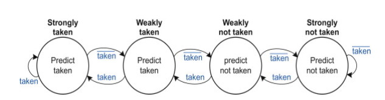

# Branch Predictor
Branch prediction is an approach to computer architecture that attempts to mitigate the costs of branching. Branch predication speeds up the processing of branch instructions with CPUs using pipelining. The technique involves only executing certain instructions if certain predicates are true. Branch prediction is typically implemented in hardware using a branch predictor.
Branch prediction is also known as branch predication or simply as predication.

# Project Tree
   * [Readme.md](README.md)
   * Codes
     -  [gui_widgets.py](gui_widgets.py)
     -  [predictor_components.py](predictor_components.py)
     -  [predictor_widgets.py](predictor_widgets.py)
   * [Contents.md](Contents.md)
   * [assets](assets)
   * [examples](examples)
 

## Branch prediction test methods includes
- Compare between simple n-bit saturating counters or simulate custom branch predictor with the following architecture and choices:

- BHT different entry types
    - n-bit saturating counters.
    - n-bit agree predictor 
        - The "Bias Bit Table" displayed would likely be part of the BTB or I-cache.

- Different Indexing methods for BHT
    - PC
    - GHR
    - GHR XOR PC (GShare)
    - PHT entry XOR PC (PShare)
    - PC index PHT, PHT entry index BHT (Local History)

- Input: list of (PC of branch instruction, T or NT)

## Usage and Dependencies
- Tkinter and pillow libraries are necessary.
- and launch/run `main.py` with Python.

- Below is an example simulation of branch prediction with 8-entry branch history table.
  
- Example text files are provided in `examples/` for simulating branch instructions from a file upload. PC values can be of any length. See [`examples/README.md`](examples/README.md) for more details.

## References
- McFarling, "[Combining Branch Predictors](https://www.hpl.hp.com/techreports/Compaq-DEC/WRL-TN-36.pdf?source=aw&subacctid=78888&subacctname=Skimlinks&adcampaigngroup=91539&awc=7168_1634183649_7110ed148465d8d1f132fb09063d57ff&jumpid=af_gen_nc_ns&utm_medium=af&utm_source=aw&utm_campaign=Skimlinks)," DEC WRL Technical
Report, 1993.
- Sprangle et al., "[The agree predictor: a mechanism for reducing negative branch history interference](https://doi.org/10.1145/384286.264210)," ISCA 1997
- Yeh and Patt, "[Two-Level Adaptive Training Branch Prediction](https://www.inf.pucrs.br/~calazans/graduate/SDAC/saltos.pdf)," MICRO 1991.
- ECE 3058, [GT HPCA](https://www.youtube.com/watch?v=tawb_aeYQ2g&list=PLAwxTw4SYaPmqpjgrmf4-DGlaeV0om4iP), and [CMU 18-740](https://www.youtube.com/watch?v=M0y_Nvb9rGA&list=PL5PHm2jkkXmgVhh8CHAu9N76TShJqfYDt) lectures.
- cwang360 / branch-prediction-visualization
- Wikipedia contributors. "Branch predictor." Wikipedia, The Free Encyclopedia
- N. Adiga, J. Bonanno, A. Collura, M. Heizmann, B. R. Prasky and A. Saporito, "The IBM z15 High Frequency Mainframe Branch Predictor Industrial Product," 2020 ACM/IEEE 47th Annual International Symposium on Computer Architecture (ISCA), 2020, pp. 27-39, doi: 10.1109/ISCA45697.2020.00014.
- Computer Architecture: [A Constructive Approach Using Executable and Synthesizable Specifications](http://csg.csail.mit.edu/6.375/6_375_2019_www/resources/archbook_2015-08-25.pdf )
- Sarah L. Harris, David Harris, in Digital Design and Computer Architecture, 2022
